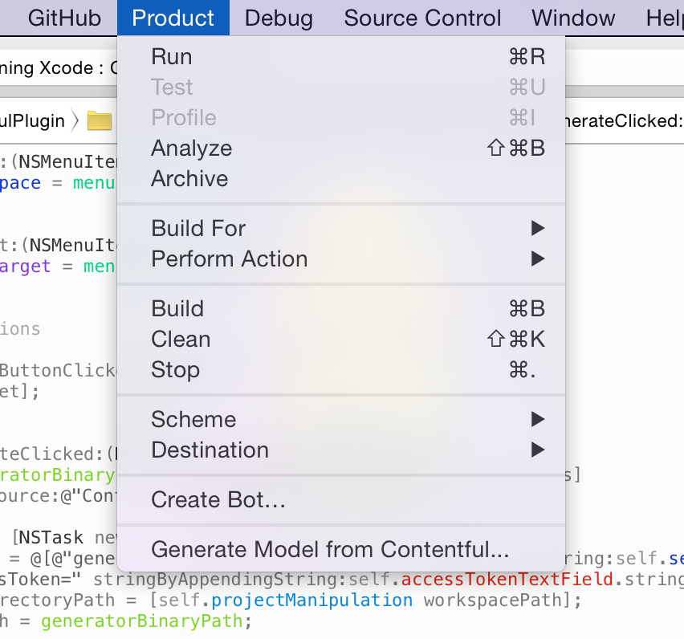
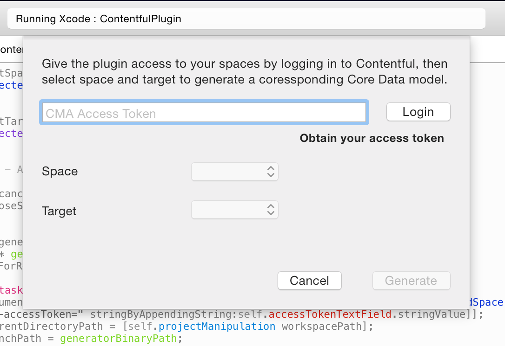

# Contentful Xcode Plugin

Xcode plugin for generating Core Data models from [Contentful][1] content models.

[Contentful][1] is a content management platform for web applications, mobile apps and connected devices. It allows you to create, edit & manage content in the cloud and publish it anywhere via powerful API. Contentful offers tools for managing editorial teams and enabling cooperation between organizations.

## Installation

Update Git submodules before building:

```
git submodule update --init --recursive
```

Building the "ContentfulPlugin" scheme will build and install the plugin.

Alternatively, download a binary build from the "releases" section and place it into *$HOME/Library/Application Support/Developer/Shared/Xcode/Plug-ins*, then restart Xcode. The plugin is compatible with Xcode 6, including 6.2 beta on OS X 10.9 and 10.10.

## Usage

The plugin adds a new "Generate Model from Contentful..." item to the "Product" menu.



This will bring up a dialog where, after providing your CMA access token, you will be able to select a space and a target from your Xcode project. 



Using this information, a Core Data model for use with our [CoreDataManager class][3] will be generated and added to the specified target. The file itself will reside in the *"Resources"* group or in the root if that doesn't exist. 

Keep in mind that your own `NSManagedObject` subclasses will still need to conform to the `CDAPersistedAsset`, `CDAPersistedEntry` and `CDAPersistedSpace` protocols as before. You will not need to provide a mapping between your content model and Core Data anymore, though, as this is [derived automatically][4] if field and property names match.

It is also required that you add content type validations for any links in your content model, as links in Core Data are always typed. If you require one link field to refer to entries of different content types, your model cannot be represented by Core Data and therefore the model generation will fail.

You can also use the model generator from the commandline:

```
ContentfulModelGenerator generate \
	--spaceKey=$CONTENTFUL_SPACE_KEY \
	--accessToken=$CONTENTFUL_MANAGEMENT_API_ACCESS_TOKEN
```

## License

Copyright (c) 2014 Contentful GmbH. See LICENSE for further details.

[1]: https://www.contentful.com/
[3]: https://www.contentful.com/blog/2014/05/09/ios-content-synchronization/
[4]: https://github.com/contentful/contentful.objc/commit/b82c0f2a68095e28d0d127bd9d070b09daf9b9ed
